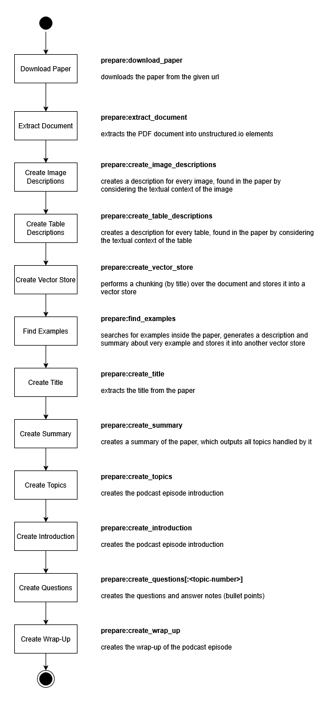

# Talking Agents

## Introduction

Talking Agents is an AI tool for automatically creating podcast episodes out 
of research papers. The paper can be given as PDF file or as an url to a PDF
file. 

The motivation for that project is, that I always want to read the latest papers
in the field of AI. However, as family father and full-time employee I rarely 
have the time sitting hours in front of my computer and reading papers. But there
are many opportunities to listen to podcasts for me: when cleaning up, when
cooking or while I commute to the office. So, I wanted to have a tool, which
can turn every research paper, I'm interested in, into an interesting 10-20 
minutes podcast episode, which is fun to listen to. 

Example episodes:
* [Episode 1: Attention Is All You Need](https://youtu.be/6xGT6v_e27U)
* [Episode 2: Chain-of-Thought Prompting Elicits Reasoning in Large Language Models](https://youtu.be/s_OSDGNtT4g)

## Installation

### Prerequisites

* Python 3.12
* [OpenAI API](https://platform.openai.com/docs/overview) Key (with at least [tier 2](https://platform.openai.com/docs/guides/rate-limits?tier=tier-two#tier-2-rate-limits), to not run into token and rate limit issues)
* [Azure Speech Studio](https://learn.microsoft.com/en-us/azure/ai-services/speech-service/speech-studio-overview) API Key
* [Unstructured.io API](https://docs.unstructured.io/api-reference/api-services/free-api) Key
* [Audacity](https://www.audacityteam.org/)
* An intro and outro music wave file (can be an empty wave, but then please adapt the mixer settings accordingly)
  * This is not included into the repository for copyright reasons
* Optionally: [LangSmith](https://www.langchain.com/langsmith) API Key

### Getting Started

1. Clone the repository to the local file system


2. Install PDM (the package manager which is used here)
```bash
pip install pdm
```


3. Change into the repository path and install the python packages of the project
```bash
cd <repository path>
pdm sync
```


4. Create an `.env` file in the repository directory (you can copy it from 
   the template `.env.template`) and add your API keys to it.


5. Start creating a podcast with:
```
pdm run create --episode-config-path episode_configs/episode_1.yaml --output-path=output --step prepare:download_document
```
**ATTENTION** This will only download the paper but not create the whole podcast. In 
order to create the whole podcast, just delete `--step prepare:download_document`
from the command. See below for more information about the podcast config and 
the controlling of podcast generation.


### Known issues

* There is are some syntax warning related to the package `pydub` like that:
  ```
  pydub\utils.py:300: SyntaxWarning: invalid escape sequence '\('
  ```
  It seems, that pydub is not actively maintained anymore and I will substitute it
  in the future. But at the moment, it works for what I need it in this project.


## Podcast Configuration

Every podcast episode is described by a configuration file. Some examples of 
configuration files are part of this repository and they can be found in the
`episode_configs` path:

```yaml
episode_number: 1
paper_url: "https://arxiv.org/abs/1706.03762"
moderator_persona: "personas/host_frank.yaml"
guest_persona: "personas/guest_sandra.yaml"
languages:
  - "en"
```

They contain the episode number, the url to the paper, the languages for which the podcast
should be generated (English only at the moment) and the personas of the moderator and guest.
Instead of a `paper_url` you can also give a `document_path`, which is a path to a local
PDF file. If `document_path` is not given, it will download the paper from the `paper_url`.

The persona configurations are given as a path relative to the episode configuration. A
persona is defined like that:

```yaml
name: "Frank"
role_description: >-
    You are the moderator of a podcast with the name 'Talking Agents'. In this podcast, papers are discussed and 
    presented to the audience in a way, that they understand the underlying concepts without reading the whole paper 
    or struggling with complicated math.
additional_information:
    - "He is a previous AI researcher from the Munich University of Applied Sciences"
    - "He is a passionate podcaster and loves to talk about AI and Machine Learning"
private_additional_information:
    - "He is excited about Machine Learning, but mostly he appears to be professional."
voice:
    en:
        ssml: '<voice name="en-US-AndrewNeural"><break time="250ms" />{text}</voice>'
```

The fields `name` and `role_description` are quite self-explanatory. The strings in the 
field `additional information` contains information, which is given to the host when 
asking questions and to the guest when answering questions, so the guest and host can 
relate to those information. In normal question answering it does not have a strong 
influence, but it is highly used for the small-talk parts of the podcast

The strings in the field `private_additional_information` are only given to the 
corresponding agent. So for the host agent, it only sees its own private information, but
not the private information for the guest.

For example the guest Sandra has the following private information:
```
Likes to do a joke about AIs does not have feeling, when getting asked 
'how are you?' But **ONLY**, when she is getting asked!
```

This is "unknown" to the host, but Sandra can make that joke every time, when she is asked
about how she feels. 

The `voice` field contains for every supported language (English only at the moment) a
ssml configuration for the voice of the agent. The voices can be easily selected (and
tested) inside the Azure Speech Studio user interface.


## Controlling Podcast Generation

The podcast is generated in many different steps, which depend on each other. The
foundation of the podcast generation is a finite state machine, which is described in 
details below. Every major state of the state machine produces an output, which is stored
inside the episode output directory. So when the execution stops here (because of an
error or debug breakpoint or because the state machine has been instructed to stop there),
it can continue at exactly this point when the generation is started again.

This allows human intervention, by stopping the podcast generation in the middle and then
reviewing and adapting the output files before the generation is continued. 

Human intervention is not a necessary step to produce a "quite good" podcast episode, 
because the application is already good enough to generate podcast episodes with 
sufficient quality. But especially when you want to publish a podcast episode, you might
want to polish it a little bit to prevent pronunciation issues of the robot voices or to
guide the question generation to an especially important topic of the paper, which was not
captured strongly enough by the AI. 

You can control the step where the generation stops with the `--step` command. It takes
a list of strings, which are separated by `:`. Every string is a state in the first-, 
second- or third-level graph (see below).

For example, to stop after the `prepare` step of the first-level graph is finished, just
add `--step prepare` to the command. And to stop after the topic creation step within
the `prepare` step just add `--step prepare:create_topics`. In a similar way it is possible
to stop the podcast generation at a certain question, by adding 
`--step interview:<question-number>`. If `--step` is not defined, it will generate the whole
podcast in a single run.


## Generated Output Files

The output files of the podcast are stored within the output directory, specified at the 
cli to start the podcast generation. Within this output directory, the podcast episode is
stored in a subdirectory `episode_x` where `x` is the episode number from the episode 
configuration. 

Inside this directory, there is again a subdirectory for every language e.g. `output_en` 
(for english) and here the final podcast episode is stored in the file
`episode_x_en_podcast.wav` and `episode_x_en_podcast.mp4`, where `x` is again the episode
number. The transcript of the podcast is stored in `episode_x_en.md` and a small teaser
(the description of the YouTube video) is stored in `episode_x_en_teaser.md`.

Outside this language specific output directory, are some intermediate results, which
are agnostic to the output language. The most important files are 
`preparation_content.json`, `interview_content.json` and `post_processing_content_en.json`.
In those files all information from all the intermediate steps can be found. 

In the `interview_content.json` is a field called `next_question`, which is an integer
index to the next prepared question to answer. While inside the `talk` field is the 
chat history between moderator and guest stored. The `next_question` index starts at
`-1`, which corresponds to the introduction, then it counts from `0` to the last index `n`
of all prepared questions and the index `n+1` corresponds to the wrap-up. 

The prepared questions are stored inside the `preparation_content.json` file, inside the
field `questions`. Here the moderator has already prepared a question and the guest
has already prepared bullet points and examples as answers to the question. Furthermore,
for every question, it stores the source of information, a groundedness score and the
redundancy score. Every question belongs to a topic, by deleting a question for a certain
topic, the `prepare:prepare_questions` will redo the questions for that topic. If a topic
is skipped (because of too low groundedness or to high redundancy) it will be stored 
inside the `skipped_topics` field. 

The second most important field of `preparation_content.json` is the `topics` list, which
contains all the topics, the moderator will find questions fore. If you want to ensure a
high quality podcast episode, it is often worth of stopping the podcast generation at
`prepare:create_topics` and review the topics list before continuing with the question 
preparation. If the topic list is already poor and redundant, the episode will be boring.


## Question and Answer Quality Measures

During the prepare question phase, all information to answer a prepared question 
is already collected from the paper in form of bullet points. At this level several 
quality measures are applied to ensure a higher quality of question and answers. 

The first measure is the **groundedness evaluation**. This checks, by using a LLM
as a judge, which statements could be found inside the source (provided by the RAG) 
and which not. So every bullet point is categorized to be grounded by source or not 
grounded by source (it could be hallucinated or just being correct common knowledge 
from the LLM).

Afterward, a ratio between grounded statements and all statements is calculated
as **groundedness score**. If an answer has a lower groundedness score than 70%
the answer is not accepted and the agent is asked to either reformulate the answer to
skip ungrounded information or to search for evidence inside the paper and/or
internet. This process is repeated 3 times, before the agent gives up.

As a next step, the answer is checked for **completeness**. In the step before, it
could have been that parts of the answer is just deleted from it, because it was
not grounded. But sometimes a question has more than just one aspect and when we
just skipp information from the answer, it could happen that we skip all information
about one aspect of the question. This would lead to incomplete answers.

An example would be the question: "Can you explain the transformer architecture
and elaborate why it is better than RNNs and CNNs." The answer will contain 
bullet points about the first aspect ("can you explain the Transformer architecture")
and the second aspect ("can you elaborate why a transformer is better than RNNs and
CNNs"). Now, if the groundedness evaluation skips all bullet points to the second
aspect, an important part of the answer will be missing. 

To avoid this, a LLM is used as a judge and to check if the bullet points answer the
question completely. If not it formulates a follow-up question to the RAG.
The answer to the follow-up question is then added to the already existing answer and
all quality measures are calculated again. 

The last measure is the **redundancy evaluation**. It measures how many bullet points
keep information, that was already present in the answers of other questions. It
categorizes every bullet point in being "new information" or "old information" and
the ratio of characters in the old information compared to the total number of 
characters is the **redundancy score**. It should not be higher than 50%. 

If the **redundancy score** is higher than 50%, or if the **groundedness score** is
lower than 70% (after the 3rd retry), the moderator agent is asked to rephrase the
question or to skip it completely. This ensures a better quality of questions and
answers inside the podcast. 


## How a Podcast is Generated

### High Level FSM

On the high level, every podcast is generated by following three steps:
* A preparation phase, which prepares all information and provides bullet points for the
  moderator and guest during the interview.
* The interview phase, where the actual talk between moderator and guest is happening
  while both are using the bullet points from the preparation step to guide the talk.
* And a post-processing phase, where the interview is transformed into an audio file
  and the final output is produces.

In the following pictures the bold text beside the state box is the step name, which
can be used to control the generation over the `--step` argument.

</img>

Of course every of those high level steps consists of many smaller steps. 

### Prepare FSM

The heavy work of podcast generation is mainly done inside the prepare-FSM.
The most complex part is the "create questions" step, which uses several sub-graphs
for performing the RAG and calculating/applying the quality measures. 

</img>

### Interview FSM

The interview FSM is just a style transfer of the notes (bullet points), generated
during the prepare phase into a "podcast style". It is a loop over all prepared 
questions, including the introduction and wrap-up, where first the moderator agent
generates its output and then the guest agent.

The question number corresponds to the index of the prepared questions, except the
number `-1`, which corresponds to the introduction and the number `n+1` (where `n` 
is the number of questions) which corresponds to the wrap-up.

### Post-Processing FSM

The post-processing FSM is invoked for every language which has been configured
for the podcast episode (at the moment only English).

</img>


## Limitations and possible Improvements

During my work on that project I identified two very important steps of the podcast
creation, which affects the output quality much more than every other step:

* the generation of the topics
* the RAG system to answer questions

Every paper tells a story. It starts with describing a problem, which currently 
exists, and it explains why already known approaches are not capable of fixing this
problem in a suitable way. Then it explains a new approach to tackle the problem and
proves over evaluation that this approach is finally better. My vision is that the
podcast catches this "story line" and explains it to the listeners in an
interesting and informative way.

To come up with such a story line, I introduced the topic generation step during the
preparation. However, while it is able to catch some important topics from the paper,
it still fails to build up an interesting story arc, described above. For further
improvements, my idea would be to categorize topics and to evaluate how important
every topic is to the paper, and then reordering and prioritize them to build up a
[3 act story arc](https://en.wikipedia.org/wiki/Three-act_structure). 

So far, I was not able to achieve this by a single prompt only, so in the future, I 
want to build a more complex topic generation, which does all this intermediate steps
of categorizing and prioritizing.

Another aspect to it is the quality of the RAG. I reworked the RAG several times to
work sufficiently good. But many parameters to it (like the chunk-size, the number of
chunks presented to the LLM and the chunking algorithm) are just selected by a gutt 
feeling and are not based on evaluation. I want to introduce an evaluation system
which helps me to improve the RAG quality. Another alternative would be, instead of 
building an own RAG, using an already battle-proofed service for it.

The last improvement, which I want to focus on in future is the orchestration of
the agents. At the moment, the agents are orchestrated by a hardcoded domain specific
process description (the graphs/FSMs). This makes it easy to debug the system and to
allow human intervention at every point. However, it makes the system also rigid to
changes in the process flow. If I want to introduce a new process step, I need to
fit it into the full structure of the already existing steps.

Instead, one could think about an agent as orchestrator, which uses textual process
descriptions to create sub-tasks, which can be processed by more specialized agents. 
In this way a change of the process would be a change in the textual process
description instead of a change in the FSM code. And a change in the output and input
of specialized agents (for example for the topic creation) would be handled flexible
by the orchestration agent, which detects that the specialized agent has now different
requirements than before. There are already plenty of papers describing such a system,
and I'm sure the "Talking Agents" podcast will present them to the audience soon.


## Acknowledgments

I want to credit [Infraction (inaudio)](https://inaudio.org/) for providing copyright free music
which I use for intro and outro of the podcast episodes. 
The song, which is used is ["Stylish Innovation Glitch"](https://www.youtube.com/watch?v=plzdqn2VxwI).
